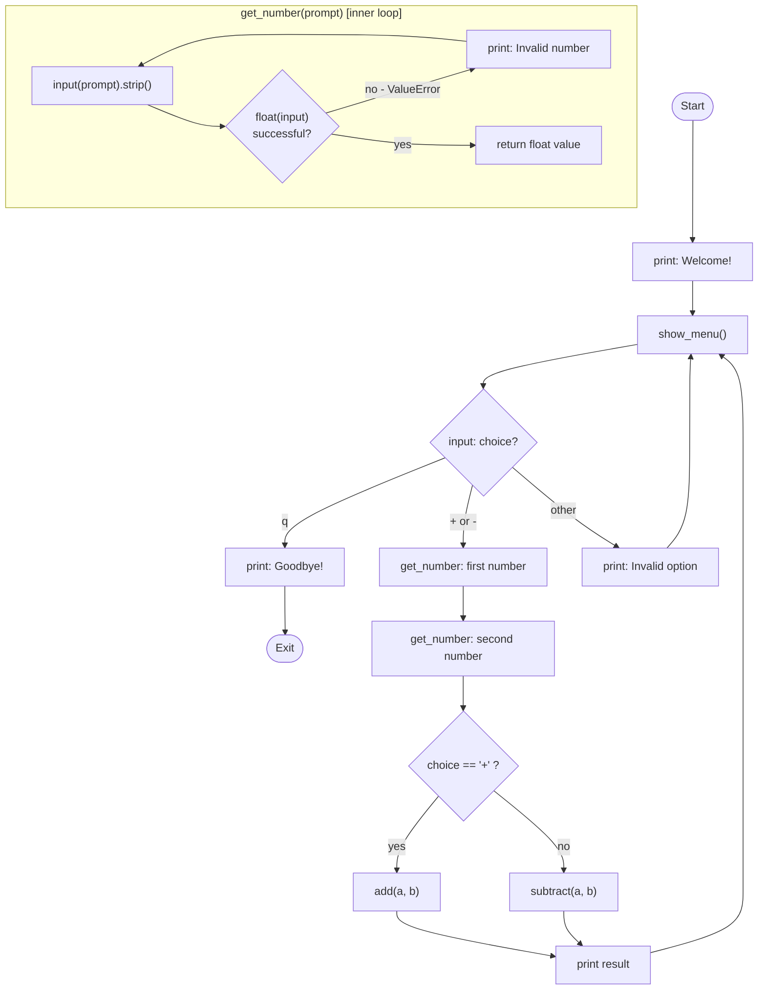

# Code Explanation: `calculator.py`
**Version:** v1.1.0
**Date:** 2026-02-20
**File:** `calculator.py`

---

## 1. Real-Life Analogies

### Analogy 1 — Starbucks Order Kiosk
Think of the calculator as a **Starbucks self-service kiosk**:

| Kiosk Step | Calculator Equivalent |
|---|---|
| Kiosk displays the menu | `show_menu()` prints options |
| You tap "Hot Drinks" or "Cold Drinks" | You type `+` or `-` |
| Kiosk asks "Size? Milk?" | `get_number()` prompts for first/second number |
| Kiosk rejects invalid input ("not a size") | `get_number()` loops on non-numeric input |
| Receipt prints your total | `print(f"{a} + {b} = {result}")` |
| You press "New Order" to go again | `while True` loop restarts `show_menu()` |
| You press "Done" | You type `q` to quit |

The kiosk **never crashes** when you tap something wrong — it just asks again. That's `get_number()`.

---

### Analogy 2 — Airport Self-Check-in Terminal
The **main loop** mirrors an airport kiosk:
- The screen refreshes and shows options after every interaction (like `show_menu()` at the top of the loop).
- Entering a wrong flight number re-prompts you (like the `else` branch printing "Invalid option").
- Choosing "Check In" starts a sub-flow asking for seat, bags, etc. (like entering two numbers after choosing `+` or `-`).
- "Cancel / Done" exits cleanly — your `q` branch.

---

### Analogy 3 — Grocery Store Self-Checkout
`get_number()` is the **barcode scanner**:
- You scan an item (type a number).
- If the barcode won't read (invalid input), the machine beeps and says "Try again" — the `except ValueError` block.
- Only a valid scan (parseable float) lets you move on.

---

## 2. High-Level Flow Diagram

### ASCII Art

```
 ┌─────────────────────────────────────────────────┐
 │                    main()                       │
 │                                                 │
 │   ┌──────────┐     ┌───────────────────┐        │
 │   │  START   │────▶│  show_menu()      │◀──┐    │
 │   └──────────┘     └────────┬──────────┘   │    │
 │                             │ input        │    │
 │                    ┌────────▼──────────┐   │    │
 │                    │  choice?          │   │    │
 │                    └─┬──────┬──────┬───┘   │    │
 │                      │      │      │        │    │
 │                   "q"│   "+"/"-"   │"other" │    │
 │                      │      │      │        │    │
 │              ┌───────▼┐  ┌──▼────────────┐  │    │
 │              │Goodbye!│  │ get_number(a) │  │    │
 │              │  EXIT  │  │ get_number(b) │  │    │
 │              └────────┘  └──────┬────────┘  │    │
 │                                 │            │    │
 │                         ┌───────▼────────┐   │    │
 │                         │  add() or      │   │    │
 │                         │  subtract()    │   │    │
 │                         └───────┬────────┘   │    │
 │                                 │            │    │
 │                         ┌───────▼────────┐   │    │
 │                         │  print result  │───┘    │
 │                         └────────────────┘        │
 └─────────────────────────────────────────────────┘

 get_number() internals:
 ┌──────────────────────────────────┐
 │  input(prompt)                   │
 │       │                          │
 │  try: float(user_input)          │
 │       │           │              │
 │    success      ValueError       │
 │       │           │              │
 │   return float  print error ─────┘ (loop)
 └──────────────────────────────────┘
```

---

### Mermaid Diagram



---

## 3. Step-by-Step Code Walkthrough

### Lines 1–2 — `add(a, b)`
```python
def add(a, b):
    return a + b
```
**Pure function.** Takes two values, returns their sum. No side effects, no state. The simplest building block — like a single arithmetic rule written on a flashcard.

---

### Lines 5–6 — `subtract(a, b)`
```python
def subtract(a, b):
    return a - b
```
Same idea. Subtracts `b` from `a`. Having these as named functions (instead of inline `a + b` in `main`) makes the code testable in isolation — you can unit-test `add()` without running the whole UI.

---

### Lines 9–15 — `get_number(prompt)`
```python
def get_number(prompt):
    while True:
        user_input = input(prompt).strip()
        try:
            return float(user_input)
        except ValueError:
            print("  Invalid number. Please try again.")
```
This is the **input guard**. Key points:

- `while True` creates an infinite retry loop — it only exits via `return`.
- `.strip()` removes accidental leading/trailing spaces from the user's input.
- `float(user_input)` converts the string. If the user types `"abc"`, Python raises `ValueError`.
- The `except ValueError` catches it, prints a friendly message, and the `while True` restarts the loop asking again.
- `"5"` → `5.0`, `"3.14"` → `3.14`. Works for integers and decimals.

---

### Lines 18–23 — `show_menu()`
```python
def show_menu():
    print("\n--- Simple Calculator ---")
    print("  + : Addition")
    print("  - : Subtraction")
    print("  q : Quit")
    print("-------------------------")
```
A **display-only** function. Prints the menu, returns nothing. The `\n` at the start adds a blank line above for readability. Isolating this as its own function means the menu can be changed in one place and affects all loop iterations.

---

### Lines 26–47 — `main()`
```python
def main():
    print("Welcome to the Simple Calculator!")

    while True:
        show_menu()
        choice = input("Choose an operation: ").strip()

        if choice == "q":
            print("Goodbye!")
            break
        elif choice in ("+", "-"):
            a = get_number("Enter first number:  ")
            b = get_number("Enter second number: ")

            if choice == "+":
                result = add(a, b)
                print(f"  {a} + {b} = {result}")
            else:
                result = subtract(a, b)
                print(f"  {a} - {b} = {result}")
        else:
            print("  Invalid option. Please choose +, -, or q.")
```

The **orchestrator**. It:
1. Prints a welcome message once.
2. Enters an infinite loop (`while True`).
3. Each iteration: shows the menu, reads a choice.
4. Routes to one of three branches:
   - `"q"` → prints goodbye and `break`s out of the loop (program ends).
   - `"+"` or `"-"` → calls `get_number()` twice, then calls the appropriate math function and prints the result.
   - Anything else → prints an error and loops back.
5. `choice in ("+", "-")` checks membership in a tuple — readable and efficient.
6. f-strings (`f"  {a} + {b} = {result}"`) format the output inline.

---

### Lines 50–51 — Guard Clause
```python
if __name__ == "__main__":  # pragma: no cover
    main()
```
This is the **Python entry point guard**.

- `__name__` is `"__main__"` only when the file is **run directly** (`python calculator.py`).
- When it is **imported** by tests (`import calculator`), `__name__` is `"calculator"` — so `main()` does NOT run automatically.
- `# pragma: no cover` tells pytest-cov to exclude this line from coverage measurement (since tests don't exercise it directly).

---

## 4. Gotcha — The `float()` Trap

**Common misconception:** "My calculator only works with whole numbers, so I should use `int()` instead of `float()`."

**Why that's wrong:**
- `int("3.14")` raises a `ValueError` — `int()` does not accept decimal strings.
- `float("3")` works fine and returns `3.0`.

Using `float()` means the calculator handles both `5` and `5.5` without any extra logic.

**Second gotcha:** The `while True / return` pattern in `get_number()` can confuse beginners who expect a loop to have a boolean exit condition. Here, `return` is the exit — the loop runs *until* we get a valid value, then immediately returns it. There is no "loop counter" or flag variable needed.

**Third gotcha:** `choice == "Q"` would NOT match. The code uses lowercase `"q"`. If a user types capital `Q`, they'll hit the "Invalid option" branch. This is a minor UX rough edge — `.lower()` on the choice input would fix it if needed.

---

## 5. Summary Table

| Function | Role | Has Side Effects? | Testable in Isolation? |
|---|---|---|---|
| `add(a, b)` | Math | No | Yes |
| `subtract(a, b)` | Math | No | Yes |
| `get_number(prompt)` | Input guard / retry loop | Yes (prints) | Yes (mock input) |
| `show_menu()` | Display | Yes (prints) | Yes (capture stdout) |
| `main()` | Orchestrator / event loop | Yes (full I/O) | Yes (mock input/output) |

---

*Generated by `/explain-code` skill — Simple Calculator project*
