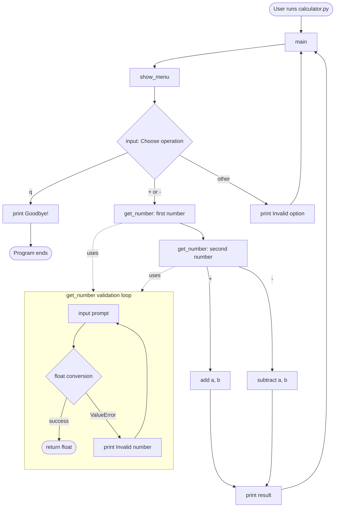

# Calculator High-Level Flow — Mermaid Diagram v1.0.0

```mermaid
flowchart TD
    A([User runs calculator.py]) --> B[main]

    B --> C[show_menu]
    C --> D{input: Choose operation}

    D -- q --> E[print Goodbye!]
    E --> F([Program ends])

    D -- + or - --> G[get_number: first number]
    G --> H[get_number: second number]

    H -- + --> I[add a, b]
    H -- - --> J[subtract a, b]

    I --> K[print result]
    J --> K

    K --> B

    D -- other --> L[print Invalid option]
    L --> B

    subgraph get_number [get_number validation loop]
        direction TB
        N1[input prompt] --> N2{float conversion}
        N2 -- success --> N3([return float])
        N2 -- ValueError --> N4[print Invalid number]
        N4 --> N1
    end

    G -.uses.-> get_number
    H -.uses.-> get_number
```
